# Geospatial Data Science Package Cheatsheet

-   packages that enable reading and writing of vector and raster data
-   packages enabling spatial analysis and modeling
-   packages that assist in producing high-quality mapping visualizations


## GeoPandas

GeoPandas is an extension of pandas, which adds support for additional data types necessary for working with spatial data. It also includes additional methods not found in pandas, which enable to perform spatial operations and produce spatial data visualizations. pandas is a foundational package required for most general data science workflows.

The core functionality of GeoPandas includes the following:

-   Reading and writing spatial data
-   Spatial data structures
-   Projection management
-   Spatial data visualization
-   Data manipulation
-   Geocoding

Reading and writing spatial data

GeoPandas natively supports reading and writing almost any vector-based dataset. This includes the ESRI shapefile and GeoJSON file formats. In order to read in files, GeoPandas relies on the Python package **Fiona**. 

To read a vector file into GeoPandas, you’ll need to leverage the following command:

geopandas.read_file()

As we mentioned in the previous lesson, you can import the GeoPandas library using its standard shorthand, or alias, **gpd**:

import geopandas as gpd

A brief aside on package imports and their alias names

When we begin a new data science workflow, it is necessary for us to import the packages or libraries that are relevant to the forthcoming analysis. When we talk about importing packages, we are telling Python to bring in a previously installed package into the working environment where we're performing our analysis.

Importing libraries can be done using the standard import for that library, such as **import geopandas**. It can also be done using the shorthand, or alias version, which looks like **import geopandas as gpd**. Leveraging an alias reduces the amount of typing that we'll have to do throughout our workflow. 

Inside the parenthesis of the **read_file** method, we'll begin passing parameters. The first parameter passed to read_file will be the file path of the data we're reading in. 


```python
capitals = gpd.read_file(data_path + 'Graticule\\\\ne_110m_graticules_10.shp')
```


GeoPandas, because it relies on Fiona, is relatively smart in its association of file type and the file type driver necessary to read in that file. However, we can specify the driver parameter and set it to **Shapefile** or another driver:

capitals = gpd.read_file(data_path + 'Graticule\\\\ne_110m_graticules_10.shp', driver='shapefile')

The **GeoPandas.read_file** method doesn’t require that the file being read in be stored locally on machine. It can read files from a URL path:

**\# Reading from a URL  
**  
url = "https://d2ad6b4ur7yvpq.cloudfront.net/naturalearth-3.3.0/ne_110m_admin_1_states_provinces_shp.geojson"  
us_states = gpd.read_file(url)

To read in files from a zipped file, you can use code similar to this:

**\# Reading in data stored in a zipped file  
**  
us_cbsas = gpd.read_file(data_path + 'tl_2021_us_cbsa.zip')

GeoPandas have ability to filter an input dataset based on the geometry of another object. To demonstrate this, we’ll execute code that will read in the US state of California and select all of the US Census Bureau **core-based statistical areas** (**CBSAs**) that intersect with California:

```python
**  
**\# Read in the US States file from the Census Tiger Files saved as a zip  
**  
us_states = gpd.read_file(data_path + 'tl_2021_us_state.zip')  
**\# Filter the US States file to be just California  
**  
california = us_states[us_states['NAME']=="California"]  
**\# Show the dataframe  
**  
california.head()  
**\# Create a new geopandas dataframe that only includes the CBSAs that are in California using the geopandas mask parameter and passing the previously defined california geopandas dataframe  
**  
ca_cbsas = gpd.read_file(data_path + 'tl_2021_us_cbsa.zip', mask=california)  
**\# Show the first 5 records of the ca_cbsas geopandas dataframe  
**  
ca_cbsas.head()  
**
```


The California GeoPandas dataframe is displayed in *Figure 1*.

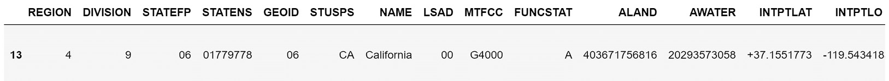

Figure 1 – California GeoPandas dataframe

The first five rows of the resulting dataframe, after using the California GeoPandas dataframe as a mask, is displayed in *Figure 2*.

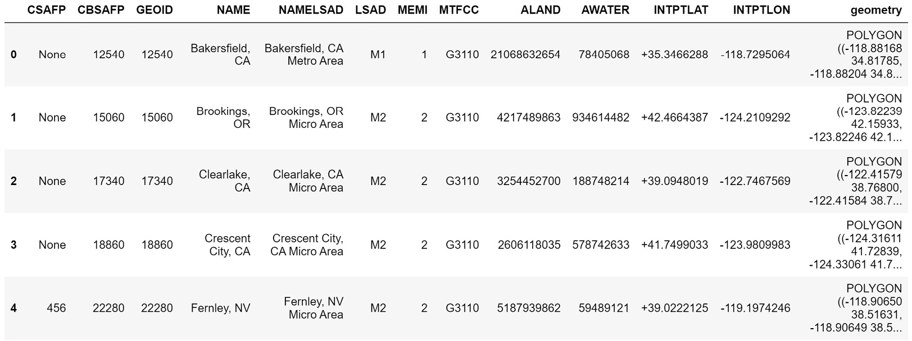

Figure 2 – California CBSAs GeoPandas dataframe

Another incremental improvement came with GeoPandas version 0.1.0 when developers added an additional filtering mechanism using **polygonal bounding boxes**. A bounding box is a polygon that surrounds an object. Here, you’ll use a bounding box to filter the **ca_cbsas** dataframe.

To filter a GeoPandas dataframe using a bounding box, you’ll first need to define the bounding box, and then pass that to the **bbox** parameter of the **read_file** method:

**  
**\# Defining the bounding box  
**  
bounding_box = (-123.82239, 42.15933, -123.82246, 38.7)  
**\#Reading in the CA_CBSAs and filtering based on the bounding box  
**  
cbsas_bbox = gpd.read_file(zipped_file, bbox=bounding_box)  
**\# Showing the first 5 rows of the filtered dataframe  
**  
cbsas_bbox.head()  
**

To write spatial data with GeoPandas, you need to leverage the **to_file** method. The **to_file** method works very similarly to the **read_file** method, except you are now creating a new file on your local machine instead of reading from an existing file. Let us begin by writing out the previously defined **ca_cbsas** file as a shapefile. To do this, you’ll define an output file path and then run the **to_file** method on the **ca_cbsas** GeoPandas dataframe. The code to perform this operation is as follows:

**  
**\# Setting the folder we want to write the output data to  
**  
out_path = r"YOUR FILE PATH"  
**\# Writing out the data as a shape file  
**  
ca_cbsas.to_file(out_path+"ca_cbsas.shp")  
**

Similar to the **read_file** method, you can also work with other file types with the **to_file** method. In the following code, we’ll write out the dataframe that was filtered using the bounding box as a GeoJSON file. Here you’ll need to specify the driver as GeoJSON, as it is not a default driver like shapefile:

**\# Writing out the data as a shape file  
**  
cbsas_bbox.to_file(out_path+"cbsas_bbox.geojson", driver="GeoJSON")

In this section, we’ve started to introduce you to the GeoPandas dataframe, one of the data structures present in GeoPandas. We’ll dive deeper into the topic of data structures in the next section.

Spatial data structures

In the previous section, we mentioned the GeoPandas dataframe quite often. Before we go too much further, it’s best we take a minute to discuss the spatial data structures that you’ll work with when using GeoPandas. The GeoPandas dataframe, also known as the **GeoDataFrame**, is one such structure. The other main data structure within GeoPandas is the **GeoSeries**. Both GeoSeries and GeoDataFrame are subclasses of the pandas Series and dataframe data structures.

The GeoSeries data structure can be thought of as a vector. Each element, or row, of the vector is a shape that corresponds to one observation or record. Each entry in a vector can be a single shape, such as a point, line, or polygon. The entry can also be a more complicated polygon that could represent an entity, such as all of the states in the United States as one record in a dataset of countries and their component regions. GeoPandas supports the three vector structures we introduced you to previously, which are points, lines, and polygons. GeoPandas also supports multi-point, multi-line, and multi-polygon geometric objects.

Let us now review some of the attributes and methods of the GeoSeries data structure:

-   Attributes:
    -   **area()**: This provides the area of the geometry in the units defined by the spatial projection.
    -   **geom_type()**: This provides the type of geometry for each element of the GeoSeries.
    -   **bounds()**: This provides a tuple of the minimum and maximum coordinates for both axis for each element.
    -   **total_bounds()**: This provides a tuple of the minimum and maximum coordinates across each axis across the GeoSeries instead of by element.
-   Methods:
    -   **to_crs()**: This changes the coordinate reference system of the data. We introduced you to this method in *Geographic and Projected Coordinate Systems*.
    -   **distance()**: This returns a series with the minimum distance from each entry to other entries.
    -   **centroid()**: This returns the **centroid** of the elements in the GeoSeries. A centroid is the geometric center of a geometric object.

The GeoPandas GeoSeries can also perform a test based on spatial relationships. A **spatial relationship** is defined as the way a set of two or more objects are set in relation to one another in geographic space. Another term for spatial relationships is **spatial topology**. Spatial relationships are typically based on adjacency, contiguity, overlap, and proximity. Two main spatial relationships included within the GeoSeries are **intersects()** and **contains()**. **intersects()** checks whether two objects intersect or overlap one another. The **contains()** test measures whether a shape is contained within another shape.

Now that we’ve introduced you to the GeoSeries data structure, let’s talk about the GeoDataFrame structure. The GeoDataFrame is essentially a collection of GeoSeries and can be thought of as similar to any tabular data structure you may have worked with in the past. The most important and unique feature of a GeoDataFrame is that it has a special GeoSeries that is referred to as a GeoDataFrame’s geometry. The geometry GeoSeries stores the geometry of each element in the GeoDataFrame. When a method or spatial relationship test is performed on a GeoDataFrame, it relies on the geometry GeoSeries. To access the geometry GeoSeries, you can use the **.geometry** attribute, regardless of whether the column is named geometry or renamed something else. Each cell in the geometry GeoSeries is a Shapely geometry which comes from the Shapely package. We’ll discuss Shapely in more depth later on in this lesson.

In the next section, we’ll discuss how to manage spatial data projections within GeoPandas.

Projection management

As we discussed at the end of *Geographic and Projected Coordinate Systems*, GeoPandas can be used to manage the projection of geospatial data. To change the projection of a GeoPandas data structure, you use the **to_crs()** method on the data structure. The **to_crs()** method in GeoPandas functions by making a subcall to the **PyProj** package. The specific method within PyProj that is being called is the **PyProj.crs.from_user_input()** method. Thus, the GeoPandas **to_crs()** method will accept anything that is accepted by the **PyProj** method, including, but not limited to, the following:

-   **A CRS** well-known text **(**WKT**) string**
-   An ESPG numeric identifier, such as **4326**, or an authority string, such as **espg:4326**
-   **A** PyProj.crs **class**

Now that you understand how to read in spatial data and manipulate its projection, let’s talk about how you can visualize geospatial data using GeoPandas.

Spatial data visualization

In *lesson 3*, *Working with Geographic and Projected Coordinate Systems*, we leveraged a package called Matplotlib to produce some very basic visualizations of capital cities across the world. Within GeoPandas, there exist a set of methods that provide a high-level interface with Matplotlib. To do this, you can simply use the **.plot()** method on a GeoSeries or a GeoDataFrame object.

As an example, we can plot the **ca_cbsas** object that we defined earlier with one simple line of code:

ca_cbsas.plot()

The output of this code is represented in *Figure 3*.

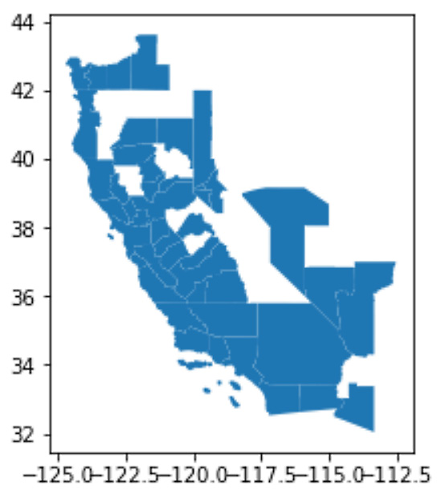

Figure 3 – California CBSAs map

The high-level mapping functionality of GeoPandas also makes it quick and easy to produce **choropleth maps**. A choropleth map is a map where each geometry on the map is colored based on a value associated with the geometry. This could include things such as population density or the amount of tax revenue in each geography. To produce a choropleth map, we need to read in some new data. Luckily, GeoPandas comes preloaded with some basic data. For this example, you’ll leverage the **naturalearth_lowres** data to produce a choropleth map of the population of each country:

**\# Choropleth Map of the world's population  
**  
\# Reading in the natural earth lowres data  
world = gpd.read_file(gpd.datasets.get_path('naturalearth_lowres'))  
**\# Plotting the data colored by the pop_est GeoSeries  
**  
world.plot(column='pop_est')

The result of running this code is the choropleth map shown in *Figure 4*.

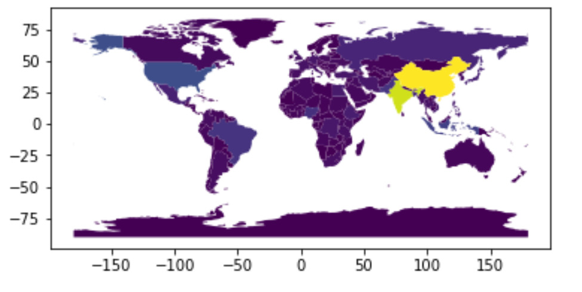

Figure 4 – A choropleth map showing the country’s population

As of right now, this map isn’t very good. Not only is the map small, but it also lacks important facets of a good map, such as axis titles and a legend that will provide the end user with the necessary context to interpret it. For now, we’ll skip over fixing these issues and will come back to it later on in *Exploratory Data Visualization*.

Data manipulations

There are numerous data and geometric manipulations that can be performed with GeoPandas. While there are too many manipulations to cover at length in this lesson, we will cover the ones that you will most frequently interact with in your day-to-day work.

Data manipulations include the following options:

-   **Append**: The GeoPandas **.append()** method makes a call to the pandas **.append()** method. The **.append()** method is used to append data from two objects at a row level. This means that the information from object two is added at the end of object one. It is important to keep in mind that the data to be appended must have the same CRS.
-   **Join**: To join two GeoDataFrames together based on a common identifier, it is best to use the **.merge()** method. This method takes two parameters by default, the GeoDataFrame object to be merged and a common identifier passed to the **on** parameter. By default, the **.merge()** method performs a left join. In order to perform other types of joins, you’ll need to pass information to the **how** parameter, which can take the following inputs: **left**, **right**, **outer**, **inner**, and **cross**.

Geometric manipulations include the following options:

-   **Buffer**: The **.buffer()** method takes a distance input passed to the **distance** parameter and returns a GeoSeries of geometries, which represents the points that fall within the given distance of the geometric object.
-   **Centroid**: The **.centroid()** method returns a GeoSeries representing the centroid of the geometric object.
-   **Simplify**: The **.simplify()** method returns a GeoSeries that represents a simplified, or smoothed, version of the input geometries. This helps reduce the memory needed by reducing the detail of complex geometries.
-   **Spatial join**: A spatial join combines two GeoDataFrames based on the spatial relationship of the observations within those two GeoDataFrames. To do this, you’ll need to leverage one of two spatial join methods in GeoPandas, the **.sjoin()** method or the **.sjoin_nearest()** method. The **.sjoin()** method joins based on binary spatial relationships, such as **intersect** or **contains**, while the **.sjoin_nearest()** method joins data based on the proximity of the observations.
-   **Dissolve**: The **.dissolve()** method is used on a lower-order geography in order to create a higher-order geography. Take, for example, the GeoDataFrame in *Figure 5*, where each observation represents a country in the world and, for your analysis, you need data at a continent level.

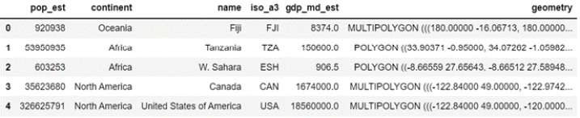

Figure 5 – World GeoDataFrame

To convert country data to continent-level data, you can run the **.dissolve()** method on the world GeoDataFrame and pass the column **continent** to the method’s **by** parameter. This returns the continents’ GeoDataFrame, represented in *Figure 6*.

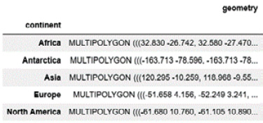

Figure 6 – continents GeoDataFrame

Plotting the newly defined **continents** dataframe produces the map in *Figure 7*.

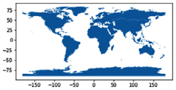

Figure 7 – continents plot

The code needed to perform these operations is as follows:

world.head()  
continents = world.dissolve(by="continent")  
continents.head()  
continents.plot()

This concludes our section on GeoPandas’ data manipulations. In the next section, we’ll talk about one final and very important functionality of GeoPandas, geocoding.

Geocoding

In addition to reading in data that already includes geographic attributes, you can also create new geographic data from addresses using GeoPandas. The process of converting addresses or place names to geographic coordinates is called **geocoding**. To perform a geocoding exercise in GeoPandas, you need to leverage the GeoPy package, which is an optional dependency of GeoPandas. The GeoPy package takes as its input a pandas DataFrame of addresses or locations without a geometry attribute column and returns a GeoDataFrame with the input address and the resulting geometry column.

To perform a geocoding operation, you’ll first need to import **geocode** from the **geopandas.tools** package. The **geocode** function takes multiple inputs, with the first being a **pandas** series that holds the addresses to be geocoded. The second required parameter is **provider**, which GeoPy is leveraging to perform the geocoding operation. GeoPandas and GeoPy, in and of themselves, are not geocoding services, and thus, the packages rely on the geocoding services provided by third parties. After you pass the provider information, you’ll also typically need to provide an **API key** that securely connects you to that provider through their **application programming interface** or **API**.

Let’s see how this works in practice. You’ll start by importing the pandas package so that you can read in a CSV file, which contains a list of addresses to three popular Washington, DC, attractions: the Washington Monument, the Smithsonian National Air and Space Museum, and the White House. To do that, you’ll need to execute the following lines of code:

import pandas as pd  
dc_attractions = pd.read_csv(data_path + 'DC_Attractions.csv')  
dc_attractions.head()

This yields the DataFrame displayed in *Figure 8* with the name of the attraction and its corresponding address.

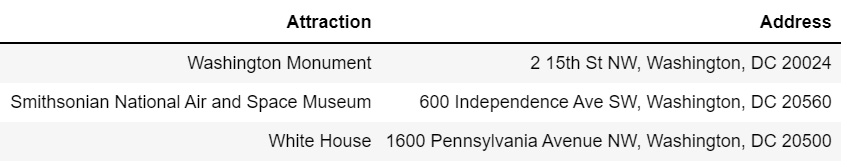

Figure 8 – Washington, DC, attractions

You can then import the **geocode** function and pass to it the address column of the pandas DataFrame.

from geopandas.tools import geocode  
dc_attractions_gpd = geocode(dc_attractions['Address'], provider='openmapquest', api_key="APIKEY")  
dc_attractions_gpd.head()

This yields the GeoPandas GeoDataFrame displayed in *Figure 9* with the address and the geometry output from the geocoding operation.

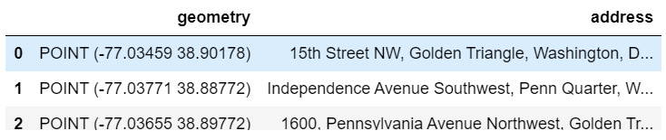

Figure 9 – Geocoded Washington, DC, attractions

In the previous line of code, we’ve chosen to use the OpenMapQuest service, which is provided by MapQuest. To leverage this same service, you’ll need to visit https://developer.mapquest.com/user/login/sign-up. Once there, fill out their free sign-up form and then visit the **Manage Keys** tab to create your API key for this application. You’ll then need to paste that API key into the quotes containing **APIKEY** in the code.

## GDAL

**GDAL** stands for the **Geospatial Data Abstraction Library**, and it is made up of two components, GDAL, which is used for manipulating and working with raster data, and OGR, which is used when working with vector data files. During your time as a geospatial data scientist, you likely won’t spend a ton of time directly interacting with GDAL, but it is important to know that GDAL provides most of the backend tools, or bindings, that are necessary for working with geospatial data in Python. These bindings are Pythonic wrappers around C++ code. To learn more about GDAL, we recommend you visit the GDAL documentation site at: https://gdal.org/api/python.html.

## Shapely

We briefly introduced you to the Shapely package earlier on in this lesson in our discussion on GeoPandas. Shapely is a Python package that is used when working with vector geometries and it includes functions that allow you to create geometries and others that allow you to perform operations on those geometries. At its root, Shapely is a Python interface for **Geometry Engine Open Source software** or **GEOS**. GEOS software is embedded in other open source software, including QGIS.

In contrast to GeoPandas, Shapely is only suited for working with one individual geometry at a time, and also, it does not possess any functions for reading or writing geospatial data. To perform functions on multiple geometries or to read and write geospatial data, you’ll need to leverage GeoPandas, which is built on top of Shapely.

At times, you may need to interact with Shapely to create geometric data. To do that, you’ll need to leverage the **geometry** and **wkt** subpackages of Shapely. You’ll do this through the following code:

**\# importing shapely subpackages  
**  
import shapely.geometry  
import shapely.wkt

The **shapely.wkt** subpackage is used to convert a WKT string to a Shapely geometry. To elaborate further, WKT is a text markup language that is used to represent vector geometries. To convert WKT to a Shapely geometry, we’ll pass the string to the **shapely.wkt.loads** function. In the following example code, we’ll create an object called **s_poly1** and display the polygon by directly calling the object:

s_poly1 = shapely.wkt.loads("POLYGON ((0 0, 0 -2, 9 -2, 9 0, 0 0))")  
s_poly1

The displayed polygon is shown in *Figure 10*.

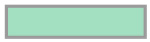

Figure 10 – WKT derived Shapely geometry

You’ll notice that the first and last coordinates in the code that produced *Figure 10* are the same. This is necessary to close the polygon, which then becomes a long rectangle.

Note

If you don’t repeat the same coordinate to close the polygon, an error message will present itself stating: **WKTReadingError: Could not create geometry because of errors while reading input**. Another error message stating: **IllegalArgumentException: Points of LinearRing do not form a closed linestring** is also produced.

You can also produce the same polygon by passing data formatted as GeoJSON. This is shown in the next code block:

**\# Creating the same polygon from GeoJSON  
**  
from shapely.geometry import Polygon  
geo = {'type': 'Polygon',  
 'coordinates': [[[0, 0],  
 [0, -2],  
 [9, -2],  
 [9, 0]]]}  
Polygon([tuple(l) for l in geo['coordinates'][0]])

Shapely can also produce multipolygons from WKT, which is demonstrated by the following code:

**\# Shapely Multi-Polygon  
**  
s_poly3 = shapely.wkt.loads("""  
MULTIPOLYGON  
(((50 40, 20 45, 45 30, 50 40)),  
((25 35, 10 30, 10 18, 30 5, 45 20, 25 35), (32 20, 26 15, 20 25, 32 20)))  
""")  
s_poly3

The result of executing the code is the multi-part polygon that is displayed in *Figure 11*.


Figure 11 – WKT derived Shapely multipolygon

In addition to converting from WKT, you can also create Shapely geometries by passing a list of coordinates to unique functions to produce your desired geometry. The list of Shapely functions that produce specific geometries is described in *Table1*.

| Shapely geometry   | Function                              |
|--------------------|---------------------------------------|
| Polygon            | shapely.geometry.Polygon()            |
| MultiPolygon       | shapely.geometry.MultiPolygon()       |
| Point              | shapely.geometry.Point()              |
| MultiPoint         | shapely.geometry.MultiPoint()         |
| LineString         | shapely.geometry.LineString()         |
| MultiLineString    | shapely.geometry.MultiLineString()    |
| GeometryCollection | shapely.geometry.GeometryCollection() |

Table1 – Shapely geometry functions

As an example of one of these functions in action, let’s leverage the **shapely.geometry.LineString()** function to make a line:

**\# Produce a Shapely LineString geometry from a list of coordinates  
**  
coords = [(5, 0.5), (5, 3), (-2, 0), (8, 0)]  
line = shapely.geometry.LineString(coords)  
line

The result is the line displayed in *Figure 12*.

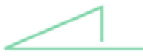

Figure 12 – Shapely LineString geometry

Now that we’ve produced a few Shapely geometries, let’s talk about the derived properties of Shapely geometries. The three main derived properties are bounds, length, and area. These properties are discussed in the following *Table2*.

| Derived Property | Functionality                                                                                                                                                                                                                        |
|------------------|--------------------------------------------------------------------------------------------------------------------------------------------------------------------------------------------------------------------------------------|
| .bounds          | Produces a tuple that represents the upper-right, upper-left, bottom-left, and bottom-right coordinates representing the outer bounds of the geometry.                                                                               |
| .length          | Calculates the length of the geometry. For Point and MultiPoint geometries, the length is 0, and for Polygon and MultiPolygon geometries, the length is the sum of the perimeters of the exteriors and any interiors of the polygon. |
| .area            | Calculates the area of the geometry. The area is non-zero for Polygons and MultiPolygon geometries.                                                                                                                                  |

Table2 – Shapely derived properties

Shapely geometries can also be used to derive new geometries by using some common methods, which are described in the following *Table3*.

| Method        | Functionality                                                                              |
|---------------|--------------------------------------------------------------------------------------------|
| .buffer()     | Returns a buffer around the geometry                                                       |
| .centroid     | Returns the centroid of the geometry                                                       |
| .envelope     | Returns a bounding box around the geometry                                                 |
| .convex_hull  | Returns the minimal convex polygon that surrounds a given set of points                    |
| .simplify     | Returns a simplified geometry from the more detailed geometry                              |
| .intersection | Returns the shared areas of two or more input geometries                                   |
| .union        | Returns a geometry representing the total geometry covered by two or more input geometries |
| .difference   | Returns the geometry covered by one geometry but not covered by another                    |

Table3 – Shapely derived geometry methods

The final topic we’ll cover on Shapely is its Boolean operations, which evaluate the relationships between geometries. The method is run on one Shapely geometry object with a second geometry object passed to the method. Those Boolean operations are described in *Table4*:

| Method         | Functionality                                                                                                    |
|----------------|------------------------------------------------------------------------------------------------------------------|
| .equals        | Evaluates whether the geometry of the two objects is equal                                                       |
| .almost_equals | Evaluates whether the geometry of the two objects is approximately equal                                         |
| .covers        | Returns true if all points of the other geometry are within the geometry of the object the method is run against |
| .crosses       | Returns true if the geometries of the two objects cross at any point                                             |
| .contains      | Evaluates whether the geometry object the method is run against contains the geometry of the other object        |
| .covered_by    | Returns true if the other geometry covers the geometry of the object the method is run against                   |
| .overlaps      | Returns true if the geometries have more than one but not all points in common                                   |
| .intersects    | Returns true if the geometries intersect in any way with regard to their boundaries or interiors                 |

Table4 – Shapely Boolean operations

Additional information on Shapely can be found in the Shapely User Manual found at https://shapely.readthedocs.io/en/stable/manual.html. This concludes our overview of Shapely. Next, we’ll talk about Fiona.

## Fiona

Fiona is a simple and easy-to-understand Python package used for reading and writing geospatial data. Fiona leverages standard Python types and protocols, including files, mappings, dictionaries, and iterators, instead of classes that are specific to OGR. Fiona reads geospatial data in a way that is modeled on the GeoJSON file format. Fiona also easily integrates with other geospatial packages, including pyproj, Rtree, and Shapely.

To read and write data with Fiona, you’ll leverage the **fiona.open()** function, which returns a file-like **Collection** object. To do this, you’ll simply import Fiona and then open the file containing the geospatial data. The following example reads in the CBSA file that you worked with previously:

**\# Importing Fiona  
**  
import Fiona  
**\# Reading in the CBSA file  
**  
f_obj = fiona.open(data_path + 'ca_cbsas.shp', 'r')  
f_obj

This code returns the **Collection** object, shown in *Figure 13*.

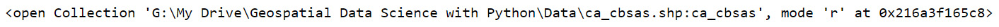

Figure 13 – The CBSA Collection object

The default mode for Fiona is **'r'**, which stands for read. To write a geospatial file, you’ll need to change this mode to **'w'**, which stands for write.

Fiona’s collection data structure supports many of the same geometry types that are included in GeoPandas and Shapely, including Point, LineString, Polygon, MultiPoint, MultiLineString, and MultiPolygon. Fiona also supports similar methods to those that are included with GeoPandas. For instance, running the **.crs** method on a Fiona collection returns the coordinate reference system of that collection.

## Rasterio

Up until this point, we’ve only discussed Python packages that are useful when working with vector data. As you may recall from *lesson 2*, vector data is only one part of the geospatial data ecosystem, with raster data being the other component. In this section, we’ll be discussing the Python package **rasterio**, which is specially developed to work with raster data formats. Rasterio is built on top of and is compatible with the NumPy Python package, which we’ll introduce you to later in this lesson in the *Reviewing foundational data science packages* section.

. Rasterio enables you to do the following:

-   Read and write raster files
-   Examine the properties of raster files
-   Convert a NumPy array into a raster file
-   Perform calculations with raster files
-   Visualize raster files

In comparison to GeoPandas’ ability to work with vector data and perform numerous functions upon that data, the Rasterio package is not as comprehensive and requires other packages to extend its functionality.

To begin this section, you’ll need to import a handful of packages, which will be leveraged throughout the section. To do that, you’ll need to execute the following lines of code:

**\# Importing the required Python packages  
**  
import rasterio  
from rasterio.plot import show  
import numpy as np  
import shapely.geometry  
import geopandas as gpd  
import glob

Processing raster data with Rasterio

To begin reading in raster file formats, such as the GeoTiff format we introduced you to in *lesson 2*, you’ll need to leverage the **rasterio.open** function. The **rasterio.open** function makes a connection to the raster data and immediately reads in the properties of it. Rasterio waits until the data is needed for a downstream function or process to read in the actual data as a way to save the memory overhead that is required to read in large raster files.

In this section, you’ll work with data from the **United States Forest Service** (**USFS**) **Landscape Change Monitoring System** (**LCMS**). The particular data set you’ll work with is the annual land cover data for the year 2021. To read in the file, you’ll need to pass the file path and **mode='r' to rasterio.open**, as shown in the next code block:

lc = rasterio.open(data_path + "LCMS_CONUS_v2021-7_Land_Cover_Annual_2021\\\\LCMS_CONUS_v2021-7_Land_Cover_2021.tif", mode='r')  
lc

You can then call the **lc** object, which is displayed in *Figure 14*, to view the connection.

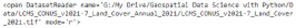

Figure 14 – Rasterio connection to 2021 land cover data

The file path will be different based on where you downloaded and stored the data folder.

Note: The Rasterio connection

The connection that is made to the GeoTiff raster data using Rasterio is similar to the text connection string that the Fiona package makes to vector data. You’ll also notice that the **.open()** functions of both packages require **'r'**, standing for read, and **'w'**, standing for write, to be passed to the function in order to differentiate between reading and writing data.

With a connection now established to the raster file, you can now review some of the properties of the raster data file. The **.name** method displays the name of the raster file while the **.meta** method displays the **metadata**; that is data about the data regarding the raster file:

lc.name

Executing the prior line of code yields the information on the **lc** object that is displayed in *Figure 15*.

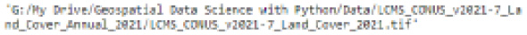

Figure 15 – Raster name

The next code block calls the **.meta** parameter to understand the metadata associated with the file:

lc.meta

Calling the **.meta** function as was done in the prior code cell results in an output of all the metadata for the **lc** object. This information is displayed in *Figure 16*.


Figure 16 – Raster metadata

The metadata provides us with useful information, such as the driver used to read the raster file, the CRS, and the count of records in the raster file. Each of these pieces of data can be directly accessed using the following methods: **.driver**, **.crs**, and **.count**. The output of calling the **.crs** method is displayed in *Figure 17*.

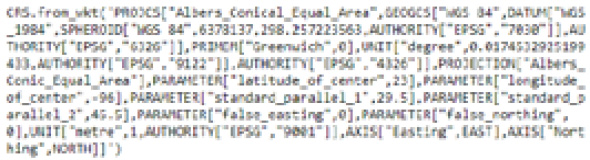

Figure 17 – Land cover raster CRS

Knowing the CRS is only one part that is necessary to georeference the raster file. The second piece of information that is needed is the coordinates of the pixels or grids that make up the raster file. To do this, you can call the **.bounds** method of the raster object. Calling the **bounds** method yields the information displayed in *Figure 18*.

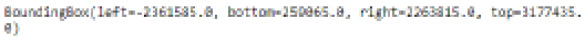

Figure 18 – Land cover raster bounds

The bounding box can then easily be converted to a Shapely geometry by passing the output of the **bounds** method to **shapely.geometry.box**. That is done by executing the next code block:

```

lc_bbox = shapely.geometry.box(*lc.bounds)
lc_bbox
```

The resulting bounding box is displayed in *Figure 19*.

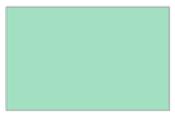

Figure 19 – Land cover raster bound as a Shapely geometry

You can now plot the raster file by passing the raster to the **show** function. Given the size of this raster file, over 15 GB of memory is required to plot the raster file. Given that most personal laptops don’t have this amount of memory, you’ll need to subset the raster file. To do that, you can create a window using the **from_bounds** method. You can then pass the window **rasterio.open** to create a new raster of only the data contained within the window. The following code performs this operation:

```Python

from rasterio.windows import from_bounds
from rasterio.enums import Resampling
left = -100000.0
right = 100000.0
top = 3177435
bottom = 259065.0
with rasterio.open(data_path + "LCMS_CONUS_v2021-7_Land_Cover_Annual_2021\\LCMS_CONUS_v2021-7_Land_Cover_2021.tif") as src:
    rst = src.read(1, window=from_bounds(left, bottom, right, top, src.transform))
    show(rst)
```

The resulting raster plot from this window is displayed in *Figure 20*.

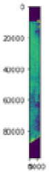

Figure 20 – Land cover window plot

Within the **show** function, you can also pass a color map (**cmap**) to display the raster using a specific color scale. In the following code, we’ve changed the bounds and are plotting the raster in greyscale by passing the **cmap="Greys"** parameter to the **show** function:

left = -150000.0  
right = 250000.0  
top = 3177435  
bottom = 2050000.0  
with rasterio.open(data_path + "LCMS_CONUS_v2021-7_Land_Cover_Annual_2021\\\\LCMS_CONUS_v2021-7_Land_Cover_2021.tif") as src:  
 rst = src.read(1, window=from_bounds(left, bottom, right, top, src.transform))  
 show(rst, cmap="Greys")

The resulting output is shown in *Figure 21*:

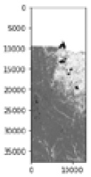

Figure 21 – Land cover window in greyscale

To write a raster to a file, you’ll again leverage the **rasterio.open()** function. Instead of using the **'r'** mode, this time you’ll need to use the **'w'** mode to write out the raster data.

When writing out the raster file, numerous parameters must be predefined and passed to the **.open** function, including the following:

-   **driver**: The file format of the resulting raster. GeoTiff is the recommended file format.
-   **height**: The number of rows of the raster data.
-   **width**: The number of columns of the raster data.
-   **bands**: The number of bands. For a single band, the value will be **1**. For rasters with red, green, and blue bands, the value will be **3**.
-   **dtype**: The raster data type represented as a **numpy** data type.
-   **crs**: The coordinate reference system, which can be an EPSG code.

# Packages enabling spatial analysis and modeling.

The prior section focused primarily on packages that enable you to work with and perform operations on spatial data. In this next section, we’ll introduce you to packages that allow you to conduct spatial data analysis and modeling.

## PySAL

**PySAL**, or the **Python Spatial Analysis Library**, is a collection of open source packages that support geospatial data science. PySAL’s collection of libraries can be broken down into four main categories:

-   **Lib**: This is the main library of PySAL, which contains the core backbone architecture for creating spatial indices, working with spatial relationships, and creating what is known as a spatial weights matrix
-   **Explore**: Contains libraries that enable you to conduct an exploratory analysis of both spatial and spatiotemporal data
-   **Model**: Contains libraries that provide estimations based on spatial relationships present in the data through the use of linear, generalized linear, and non-linear models
-   **Viz**: Is a library that enable you to visualize spatial data and the patterns within it to optically detect clusters, hotspots, and outliers

Lib

Inside the Lib component of PySAL exists one package known as **libpysal**. The packages that are contained within the Explore and Model components of PySAL are built upon the infrastructure contained within **libpysal**. **libpysal** contains the following four main modules:

-   **libpysal.weights**: This creates a spatial weights matrix
-   **libpysal.io**: This handles input and output
-   **libpysal.cg**: This handles computational geometry
-   **libpysal.examples**: This contains example datasets for use in **libpyal**

Explore

Inside the Explore component of PySAL there exist the following seven packages:

-   **esda**: The **esda** package enables you to conduct **exploratory spatial data analysis** (**ESDA**); that is traditional **exploratory data analysis** (**EDA**) with a spatial context. ESDA contains functions for measuring autocorrelation on continuous and binary data at a global and local level.
-   **giddy**: **Giddy** stands for **GeospatIal Distribution DYnamics**, and it is an extension of the ESDA package, which enables you to perform operations on spatiotemporal data. Giddy enables measurements for the impact of spatial relationships within temporal data.
-   **inequality**: This provides for the analysis of inequities across space and time.
-   **momepy**: This is a library for urban morphometrics. **Urban morphometrics** is an emerging field providing an unsupervised and systematic approach for classifying and measuring the urban form.
-   **pointpats**: This is a package that enables point pattern analysis.
-   **segregation**: This provides for the analysis of segregation across space and time.
-   **spaghetti**: This stands for **SPAtial GrapHs: nETworks, Topology, and Inference**. The **spaghetti** package enables the analysis of network-based spatial data and network events.

Model

The Model component of PySAL consists of the following eight packages:

-   **access**: This enables the measurement of mismatches in supply and demand across space. Measurement of mismatched supply and demand is critical within a number of industries. As an example, consider the demand on a local hospital network and the location of hospitals serving those patients. In this domain, the appropriate solution to this problem can be the difference between life and death.
-   **mgwr**: **MGWR** stands for **multiscale geographically weighted regression**. The **mgwr** package also includes functionality supporting **geographically weighted regression** (**GWR**). GWR assumes that the spatial process that is being modeled exists at the same spatial scale, while MGWR relaxes that assumption to model the process at different scales.
-   **spglm**: **spglm** stands for **spatial generalized linear model** and is an adaptation of the **generalized linear model** (**GLM**). At the time of writing, spglm supports Gaussian GLM, Poisson GLM, quasi-Poisson GLM, and Logistic GLM. The **spglm** package is based upon the **statsmodels** package and is integrated into the **spint** and **mgwr** packages inside PySAL.
-   **spint**: **SpInt** stands for **spatial interaction**. The **spint** package provides a collection of techniques for studying processes related to spatial interaction as well as analyzing data related to spatial interaction. At the time of writing, the **spint** package supports unconstrained gravity models, production-constrained models, constrained models, and doubly constrained models.
-   **Spopt**: **spopt** stands for **spatial optimization**, and the **spopt** package supports analysis and models related to facility location optimization and transportation modeling.
-   **spreg**: **spreg** stands for **spatial regression**, and the **spreg** package enables simultaneous autoregressive spatial-based regression models.
-   **spvcm**: This enables you to estimate **spatially-correlated variance component models** using Gibbs sampling.
-   **tobler**: This enables **areal interpolation**, which is the process of making estimates from source polygons onto overlapping but not identical polygons. The **tobler** package also supports **dasymetric mapping**, which is a refinement of choropleth maps using areal interpolation.

Viz

The Viz component of PySAL contains the following three packages:

-   **legendgram**: This is a lightweight package for displaying the distribution of the underlying spatial data within the map legend
-   **mapclassify**: This is a package for supporting classification based on choropleth maps
-   **splot**: This is a lightweight package enabling quick static and dynamic visualizations

At this point, this is all of the detail that we’ll go into in regard to PySAL because we will heavily utilize a variety of PySAL packages in *Part 2*, *Exploratory Spatial Data Analysis,* and *Part 3*, *Geospatial Modeling Case Studies,* of this book.

# Packages for producing production-quality spatial visualizations

In this section, we’ll introduce you to five packages that will enable you to produce spatial visualizations, namely static and interactive maps, which will take your resulting analytical deliverable to the next level. The packages we’ll be discussing are **ipyLeaflet**, **folium**, **geoplot**, **geoviews**, and **datashader**.

## ipyLeaflet

**ipyLeaflet** is a Python package that enables you to create interactive mapping widgets within the Jupyter Notebook IDE. At its core, **ipyLeaflet** is a connection between the Python IDE and the open sourced, JavaScript-based Leaflet visualization package.

To begin exposing you to the power of **ipyLeaflet**, let’s work through creating an interactive map of the attractions in Washington, DC. First, you’ll need to import a number of modules from **ipyleaflet** and a handful of other packages, such as GeoPandas, for working with spatial data. To do that, you’ll execute the following lines of code:

**\# Importing the packages  
**  
from ipyleaflet import (Map, GeoData, basemaps, WidgetControl, GeoJSON,  
 LayersControl, Icon, Marker,basemap_to_tiles, Choropleth,  
 MarkerCluster, Heatmap,SearchControl,  
 FullScreenControl)  
from ipywidgets import Text, HTML  
import geopandas as gpd  
import json

With the packages imported, you can now begin working with the data. Similar to what was done previously, you’ll import the attractions file, geocode the data, and then perform a join to bring back the name of the attraction into the GeoDataFrame. To do this, leverage the following code:

import pandas as pd  
dc_attractions = pd.read_csv(data_path+ 'DC_Attractions.csv')  
from geopandas.tools import geocode  
**\# Geocode addresses using Nominatim.   
Remember to provide a custom "application name" in the user_agent parameter!  
**  
Dc_attractions_gpd = geocode(dc_attractions['Address'], provider='openmapquest', timeout=4, api_key="APIKEY")  
dc_attractions_gpd = dc_attractions_gpd.join(dc_attractions[['Attraction']])  
**\# Adding in lat and lon columns  
**  
dc_attractions_gpd['lon'] = dc_attractions_gpd['geometry'].x  
dc_attractions_gpd['lat'] = dc_attractions_gpd['geometry'].y  
dc_attractions_gpd.head()

With the data created, you can now begin creating your **ipyLeaflet** interactive map. First, you’ll define the map as **DC_Map** by calling the **Map** function of **ipyLeaflet**. To the **Map** function, you’ll pass in a basemap, a center point for the map to focus on, and a zoom level. You can then call the **DC_Map** object to show it in the Jupyter Notebook IDE. The basemap and the center point are important items to pass to the function as they focus the map and the reader on the area of interest with the necessary context as to what they’re looking at:

DC_Map = Map(  
 basemap=basemap_to_tiles(basemaps.Stamen.Toner),  
 center=(38.89951498583087, -77.03599825749647),  
 zoom=12  
)  
DC_Map

The resulting interactive map currently looks like the screenshot displayed in *Figure 22*.

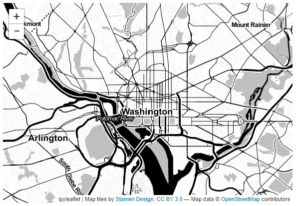

Figure 22 – Initial DC map

Leaflet basemaps

There are numerous **Leaflet** basemaps that can be used within your interactive map. Determining the appropriate basemap depends on your analysis. Keep in mind that basemaps exist to provide context and center the end user of the map. For a complete list of basemaps, visit https://ipyleaflet.readthedocs.io/en/latest/map_and_basemaps/basemaps.html.

To add points that represent the attractions, you’ll need to iterate over the rows inside the GeoDataFrame. We’ll do this by using the **iterrows** function. As we iterate, you’ll pass the latitude and longitude previously defined into the **Marker** function from **ipyLeaflet**. Once the marker is created, you’ll use the **add_layer** function to add the marker to the map:

**\# Mapping the attractions  
**  
for (index, row) in dc_attractions_gpd.iterrows():  
 marker = Marker(location = [row.loc['lat'], row.loc['lon']], title=row.loc['Attraction'])  
 DC_Map.add_layer(marker)

The resulting output is shown in *Figure 23*.


Figure 23 – DC map with attractions

You’ll notice that as you hover over the plotted points, the name of the attraction shows up. This functionality was enabled previously by passing the **title** parameter to the **Marker** function.

While this is not nearly an exhaustive overview of the **ipyLeaflet** package, it does begin to show you the power within its functions.

## Folium

**Folium** is another visualization package within Python that enables interactive maps. Similar to **ipyLeaflet**, **folium** is built upon the Leaflet visualization package. Folium is better suited for mapping geospatial data that does not change, whereas **ipyLeaflet** is better suited for dealing with user input from the front end that can change the state of the map.

As you may remember, during the section where we discussed GeoPandas, we used the **.plot** method to plot a choropleth map of the world’s population. You can now leverage folium to make that map more dynamic and appealing to the end user. To do that, you’ll first need to import folium and the required data, as shown in the following code:

**\# importing the folium and geopandas package  
**  
import folium  
import geopandas as gpd  
**\# Reading in the natural earth lowres data  
**  
world = gpd.read_file(gpd.datasets.get_path('naturalearth_lowres'))

With the data ready to go, you can then create a folium map similar to an ipyLeaflet map. To do so, you’ll first define a folium map object by calling **folium.Map()**. Next, to produce a choropleth map, you’ll call the **folium.Choropleth** function and pass to it the data. By executing the following code, you’ll have produced a choropleth map similar to the one shown in *Figure 24*:

pop_map = folium.Map()  
folium.Choropleth(  
 geo_data=world,  
 name="Population Choropleth map",  
 data=world,  
 columns=["name","pop_est","gdp_md_est"],  
 key_on="feature.properties.name",  
 fill_color="YlGn",  
 fill_opacity=0.7,  
 line_opacity=0.2,  
 legend_name="Estimated Population",  
).add_to(pop_map)  
folium.LayerControl().add_to(pop_map)  
pop_map

The resulting folium map is displayed in *Figure 24*.

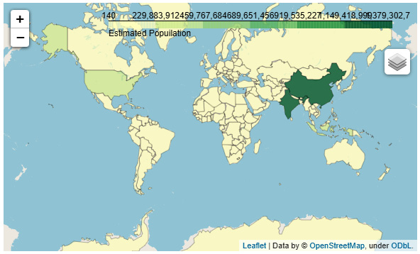

Figure 24 – Interactive Folium choropleth map of the world population

Because Folium has largely the same functionality as **ipyLeaflet**, we won’t go into too much detail at this time. For more information on the folium package, we recommend that you visit the folium documentation page at: https://python-visualization.github.io/folium/index.html.

## geoplot

**geoplot** is a static visualization library for geospatial data. The **geoplot** library is an extension of **cartopy** and **matplotlib**. The goal of **geoplot** is to make creating mapping visualizations simple and easy. The ease of use of **geoplot** comes from its high-level mapping API and its native support for projections. For brevity, we’ll demonstrate **geoplot** cartogram functions. A **cartogram** is a map in which statistical information is shown in a diagram-based format.

To begin, you’ll import **geoplot** while using its alias **gplt**. You’ll also need to import the **gcrs** subpackage to work with coordinate reference systems inside **geoplot**. Finally, to work with data we’ll again leverage **geopandas**:

import geoplot as gplt  
import geoplot.crs as gcrs  
import geopandas as gpd  
**\# Reading in the natural earth lowres data  
**  
world = gpd.read_file(gpd.datasets.get_path('naturalearth_lowres'))

With the packages and data imported, you can create your first cartogram. For this cartogram, let’s show what the North American continent looks like when the map is scaled to the area of the component country’s landmass. To do this, you’ll execute the code in the next code block:

gplt.cartogram(world[world['continent']=="North America"], scale=world['area'])

The cartogram produced by executing the code is displayed in *Figure 25*.

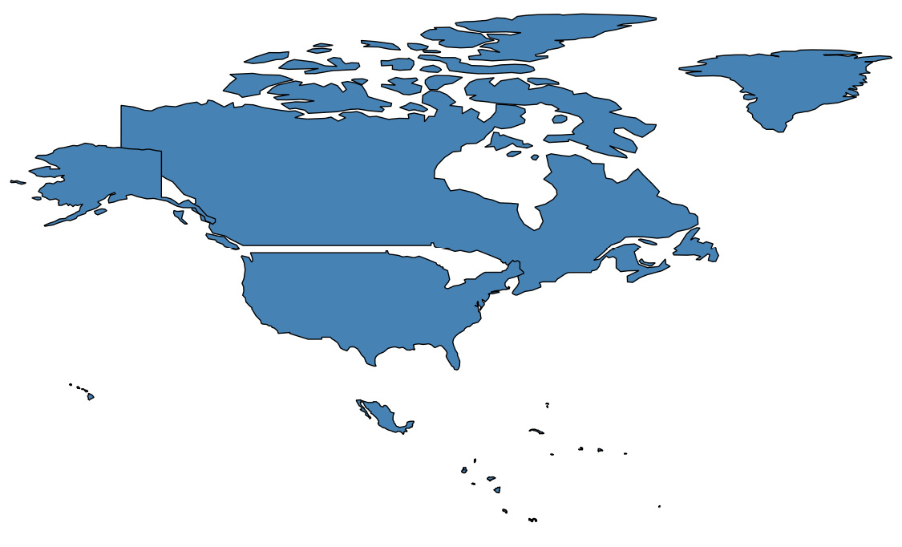

Figure 25 – A geoplot cartogram of North American land area

In comparison to the cartogram based on land area, you could instead create a cartogram based on the population estimate of each North American country. To produce this type of visualization, you’ll execute the next code block:

gplt.cartogram(world[world['continent']=="North America"], scale='pop_est', projection=gcrs.AlbersEqualArea())

The resulting population estimate-based cartogram is displayed in *Figure 26*.

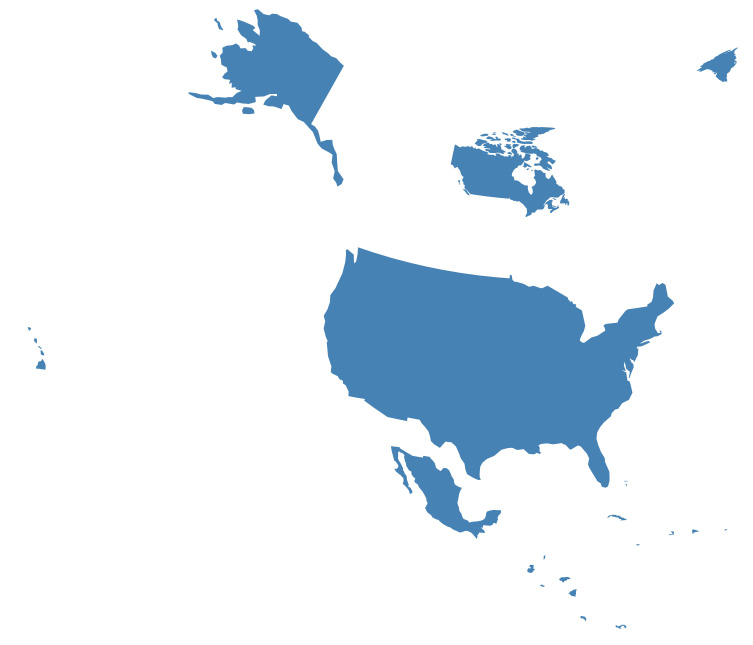

Figure 26 – A geoplot cartogram of North America’s estimated population

From these two cartograms, you can deduce that there are a lot more people per unit of area measurement in the United States than there are in both Canada and Mexico.

## GeoViews

**GeoViews** is another interactive spatial data visualization library with the goal of making it easy for spatial data scientists to create and explore map-based visualizations. GeoViews is built on top of the **HoloViews** library, which is beneficial in creating visualizations on highly dimensional data. Spatial visualizations created with GeoViews can be static using **matplotlib** or dynamic using **bokeh** to render the data. GeoViews integrates well with GeoPandas, Iris, and Xarray allowing for easy mapping of both vector and raster data structures.

As a simple example, you’ll pull from the preloaded features within **geoviews** to create a map of the Earth. To do this, you’ll import **geoviews** using its standard alias **gv**, the feature subpackage of **geoviews** as **gf**, and **cartopy**:

import geoviews as gv  
import geoviews.feature as gf  
from cartopy import crs  
gv.extension('bokeh', 'matplotlib')

With the packages imported, you can then plot an interactive visual of the world using the Bokeh backend by executing the next code block:

( gf.ocean \* gf.land \* gf.coastline \* gf.borders).opts(  
 'Feature', projection=crs.Geostationary(), global_extent=True, height=275)

The resulting visual, in static form, is shown in *Figure 27*.

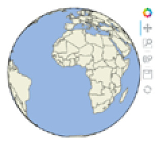

Figure 27 – GeoViews map of world countries

You can easily interact with the visualization by using the Bokeh toggles on the right-hand side. These enable you to quickly pan, zoom, and save the visualization to your computer as a **.png** file for use in other mediums, such as a report or presentation.

## Datashader

Datashader is relatively new to the world of geospatial data visualizations and helps solve the problem of mapping big geospatial data. As we’ve mentioned in previous sections, geospatial data is memory intensive to work with. To enable the visualizations to be mapped more efficiently, Datashader breaks the visualization pipeline down into intermediary steps and then uses the Numba and Dask packages to distribute the computation across the CPUs of the machine rendering the visual. By doing this, Datashader enables visualizations of big geospatial data on machines with standard hardware specifications. To learn more about Datashader visit: https://datashader.org/.

# Reviewing foundational data science packages

In this section, we’ll cover a handful of more generalized data science packages, which will be useful within your spatial data science workflows. While these packages are useful for spatial data science, they are not purpose-built for spatial data science workflows, such as the packages covered previously in this lesson.

## pandas

pandas is the primary Python package for reading, writing, and manipulating tabular data. As you may recall, the GeoPandas package is built on top of pandas and leverages most of pandas’ core functionality. In our coverage of GeoPandas, we did not cover all of the specialized functionality of pandas, which we’ll work to cover in this section. Let’s start with data structures.

Data structures

The primary pandas data structures are Series and DataFrame. As you may recall from the previous lesson, the GeoPandas’ GeoSeries and GeoDataFrame data structures are based on the Series and DataFrame structures within pandas.

A Series data structure is a one-dimensional array that is labeled. The following illustration is an example of a Series with three observations:

| Observation1 |
|--------------|
| Observation2 |
| Observation3 |

Table5 – A pandas Series illustration

Series can store numerous types of data, including the following:

-   Integers
-   Floating point numbers
-   Strings
-   Other Python objects

To create a Series, you can define it dynamically or pass one of the following objects:

-   A list
-   A one-dimensional NumPy array
-   A dictionary

The DataFrame data structure is a two-dimensional structure. When you think of DataFrame, you can think of it as a collection of pandas Series. Each column in the DataFrame object holds observations that correspond to a single variable. The data stored in the other columns of a DataFrame may be of the same data type or of a different data type. *Table6* illustrates a DataFrame with multiple data types.

| Month | Unit Sales | SalesDollars |
|-------|------------|--------------|
| 1     | 4          | 1796.12      |
| 2     | 6          | 2534.80      |
| 3     | 12         | 15097.66     |

Table6 – pandas DataFrame illustration

DataFrame – pandas versus GeoPandas

The primary difference between the GeoPandas DataFrame and the pandas DataFrame is that the GeoDataFrame includes a column that holds the geometry object of the observation. These geometry objects could be a state administrative boundary represented as a polygon, a point that represents a city center, or a line that represents a roadway. There is no concept of geometry within the base pandas DataFrame’s data structure.

To create a DataFrame, you can pass one of the following objects:

-   A dictionary containing lists, dictionaries, Series, or one-dimensional NumPy arrays
-   A Series
-   A two-dimensional NumPy array

There are multiple functions within pandas that allow you to read and write tabular data. The functions are listed in *Table7* as follows:

| File Type | Operation |                |             |
|-----------|-----------|----------------|-------------|
|           | Reading   | Writing        |             |
|           | CSV       | .read_csv()    | .to_csv()   |
|           | Excel     | .read_excel()  | .to_excel() |
|           | JSON      | .read_json()   | .to_json    |
|           | Pickle    | .read_pickle() | .to_pickle  |

Table7 – Reading and writing files with pandas

Now that we’ve discussed the pandas DataFrame’s data structures, let us move on to discussing how to subset a DataFrame in the next section.

Subsetting pandas DataFrames

In order to subset or select a portion of the data in a DataFrame, you’ll utilize indexing. Indexing can be done via column, row label, row integer, or slice. See *Table8* for more information.

| Procedure               | Code                      |
|-------------------------|---------------------------|
| Selecting a column      | df['column']              |
| Selecting via row label | df.loc[label]             |
| Selecting via integer   | df.iloc[integer location] |
| Selecting via slice     | Df[1:7]                   |

Table8 – Subsetting a pandas DataFrame

Another more complex subsetting method comes in the form of Boolean indexing, whereby you use a column’s values to subset the DataFrame. We’ll walk through an example of Boolean filtering later on in this lesson in the section titled *Combining pandas data structures*.

Methods for exploring pandas DataFrame

There are multiple methods for exploring a pandas DataFrame so that you can begin to understand the data you’re working with. You can think of this as the first foray into a deeper process called **exploratory data analysis** (**EDA**). EDA is a general process of gathering statistics and visuals describing your dataset so that you begin to understand what it represents and how to use it in your analysis. We’ll discuss a lot more about EDA and its sister, **exploratory spatial data analysis** (**ESDA**) in *Part 2*, *Exploratory Spatial Data Analysis*. *Table9* details the four most basic data exploration methods in Pandas.

| Procedure                                       | Code          | Result                                                                                                                                                      |
|-------------------------------------------------|---------------|-------------------------------------------------------------------------------------------------------------------------------------------------------------|
| View the first **n** number of rows             | df.head(n)    | Prints the first **n** number of rows. By default, **n** is set to 5.                                                                                       |
| View the last **n** number of rows              | df.tail(n)    | Prints the last **n** number of rows. By default, **n** is set to 5.                                                                                        |
| View descriptive statistics for the DataFrame   | df.describe() | Prints descriptive statistics, including the count, mean, minimum, maximum, and quartiles of the data.                                                      |
| View metadata and memory usage of the DataFrame | df.info()     | Prints the number of columns, the data types, and memory usage. If the verbose parameter is set to **True**, it also prints the number of non-null records. |

Table9 – Methods for exploring pandas DataFrames

This concludes our discussion on data exploration within pandas. Next, we’ll talk about combining pandas data structures.

Combining pandas data structures

There are three primary functions used to combine pandas Series and DataFrames: **concat**, **merge**, and **join**.

The following list details these functions:

-   **pandas.concat()**: Combines data along a prescribed axis. Its primary parameters are the following:
    -   **objs**: The Series or DataFrame objects to be combined.
    -   **axis**: The axis on which to combine the data. When set to **0**, combines data vertically along the index. When set to **1**, combined data horizontally.
    -   **join**: Used when columns overlap in the objects to be combined. Accepts either **'inner'** or **'outer'**.
-   **Pandas.DataFrame.merge():** Combines data using database-like joins. Its primary parameters are the following:
    -   **right**: The right-hand DataFrame.
    -   **how**: The type of join to be performed (e.g., **'inner'**, **'outer'**, **'left'**).
    -   **on**: The common/key columns to merge upon.
    -   **left_on**/**right_on**: The common key to merge the data upon if the keys are named differently in the left and right DataFrames.
-   **pandas.DataFrame.join()**: Combines data using common columns. Its primary parameters are the following:
    -   **other**: The right-hand DataFrame.
    -   **on**: The common/key columns to merge upon.
    -   **how**: The type of join to be performed. Accepts: **'left'**, **'right'**, **'outer'**, **'inner'**.

pandas example

Earlier in this lesson, you conducted an exercise where you geocoded addresses of attractions around Washington, DC. Let’s take that data and do some additional workflows with it. Firstly, you may have noticed that when you geocoded the data that the name of the attraction was not in the GeoDataFrame. To correct this, let’s use the **.merge()** function to bring back the name of the attraction. To do that, you’ll run the following lines of code:

final_gpd = dc_attractions_gpd.merge(dc_attractions[['Attraction']], how='left',left_index=True, right_index = True)  
final_gpd.head()

In this code, you’re merging the original pandas DataFrame to the geocoded GeoDataFrame based on the left and right indexes of the input frames. If we had a common identifier in the two frames, we could have used the **on** parameter instead of the **left_index=True** and **right_index=True** parameters. The resulting output of the merged GeoDataFrame is displayed in *Figure 28*.

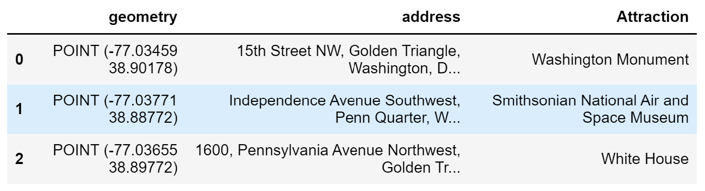

Figure 28 – Merged GeoDataFrame with the attraction name

Now that you’ve brought over the attraction name, you can perform a Boolean filtering operation to extract the White House as its own DataFrame. To do that, you’ll execute the next line of code:

wh = final_gpd[final_gpd['Attraction'] == 'White House']  
wh.head()

To better understand the Boolean filter, you can execute the following line of code:

final_gpd['Attraction'] == 'White House'

You’ll notice that the results are **False**, **False**, **True**. This is the result of the Boolean filter, which compares every record in the **Attraction** column to the condition **'White House'** to identify which record(s) correspond to the White House.

Finally, let’s explore the **final_gpd** DataFrame to get a better sense of its contents. To do this, we can execute the **.info()** method on the GeoPandas GeoDataFrame by running the following code:

final_gpd.info()

The results of this are displayed in *Figure 29*.

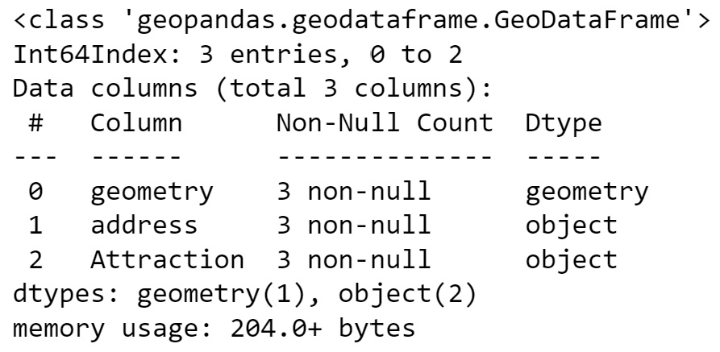

Figure 29 – Exploration of the final_gdf GeoDataFrame

In this section, you’ve learned how to interact with non-spatial data using pandas and its Series and DataFrame structures. You’ve also learned how to conduct some initial EDA using pandas functions. This section concluded with a discussion about how to combine pandas structures. In the next section, we’ll discuss scikit-learn, which is one of the primary modeling packages leveraged in standard data science activities.

## scikit-learn

scikit-learn is one of the most robust machine-learning libraries accessible within Python. The scikit-learn library is built upon the SciPy library, which implements a number of algorithms covering methods from optimization to differential equations. scikit-learn expands upon these algorithms, allowing for the development of solutions for classification, regression, clustering, and dimensionality reduction-based problems. In addition to this, it includes functionality for measuring model performance and developing end-to-end modeling pipelines.

As mentioned previously, we will primarily be using PySAL for the geospatial data science modeling use cases covered in *Part 3,* *Geospatial Modeling Case Studies*. In addition to PySAL, we will leverage aspects of scikit-learn, including its data pre-processing steps, clustering algorithms, and its ability to integrate a **spatial weights matrix**. A spatial weights matrix is a representation of spatial structures via quantification made based on contiguity or distance. We’ll elaborate further on this in the next few lessons.

Now that we’ve covered the geospatial Python packages and a handful of generalized data science packages you’ll be leveraging in the remainder of this text, let’s transition into a discussion on how to set up your geospatial data science environment.

