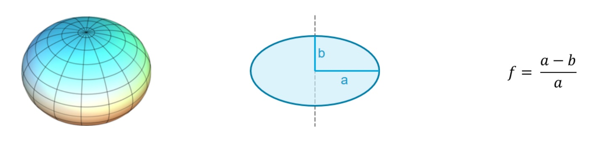
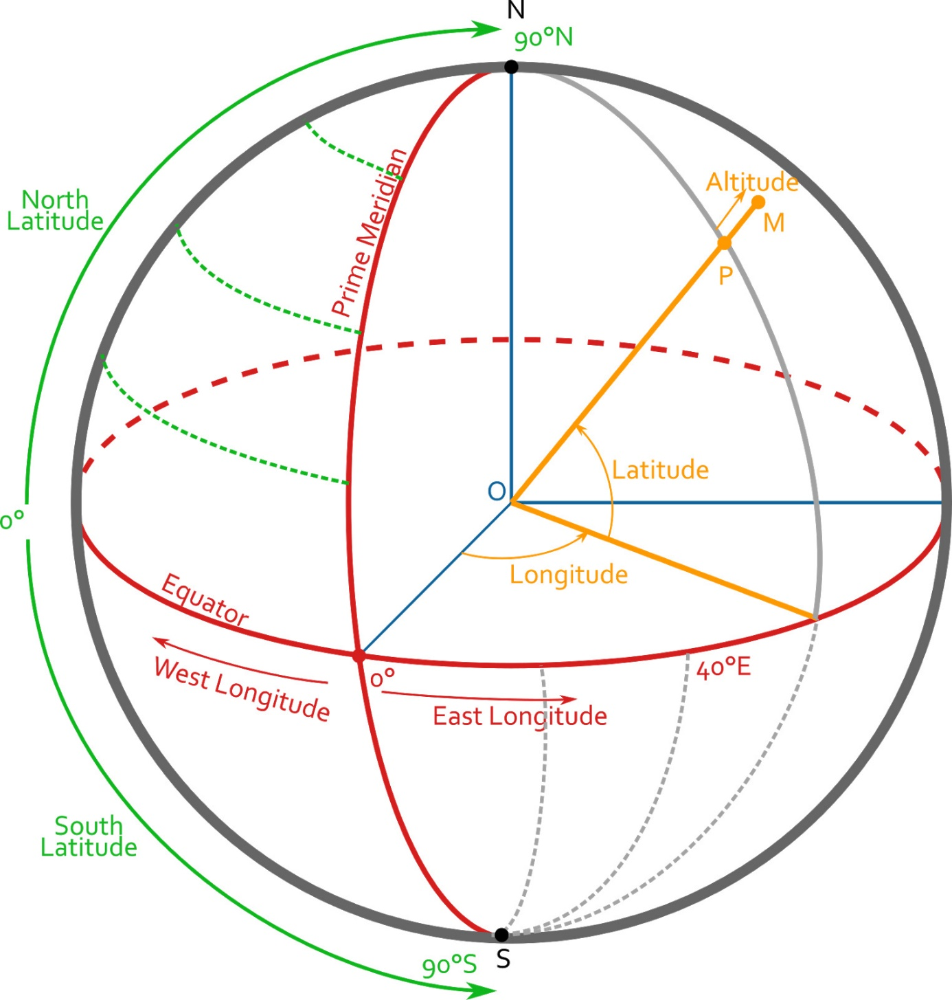
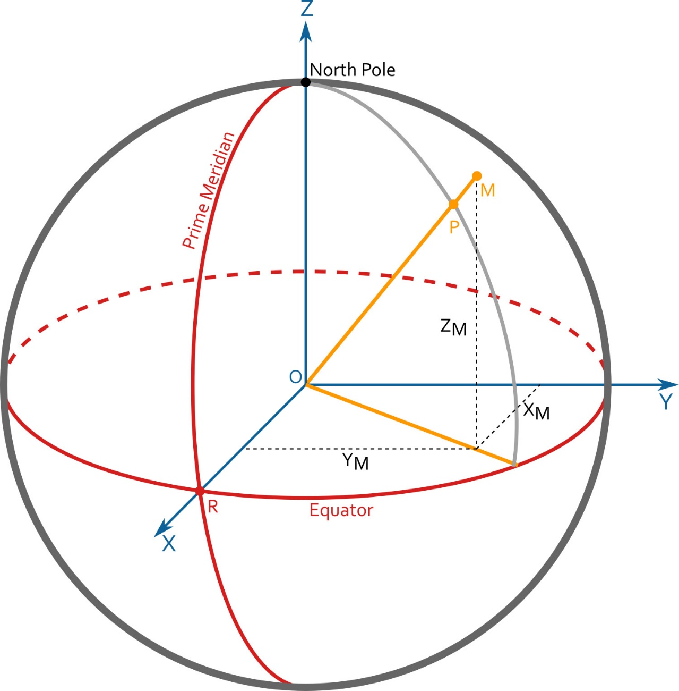
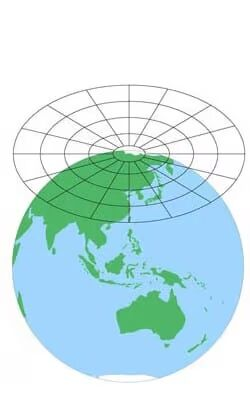
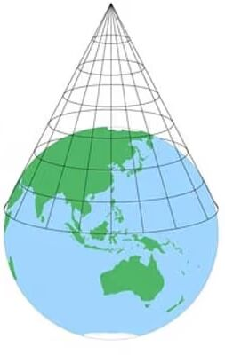
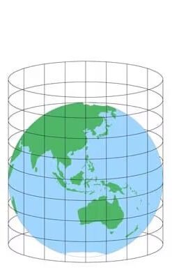
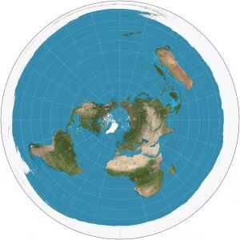
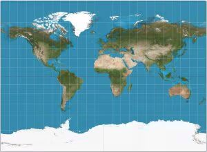
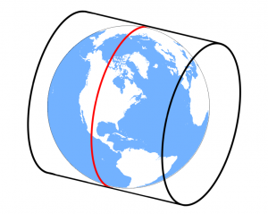

### Coordinate Reference Systems (CRS) and Ellipsoids

When it comes to locating objects on a planet, one must choose a Coordinate Reference System (CRS) to express the location.

What makes it complicated is that planets are neither planes nor spheres: they are ellipsoids. There are different ellipsoid models (called datums), the most well-known one being the WGS84 for Earth.

For example, with the WGS84 ellipsoid, there is an approximate 22km of difference between the lengths of the axes!

-   a = 6 378 137.0 m
-   b = 6 356 752.314 245 m
-   1/f = 298.257 223 563

Each Coordinate Reference System defines locations using the ellipsoid model it is based on. However, there are different kinds of CRS, each with additional properties.

### Geographic CRS

A geographic CRS uses polar coordinates to express the location of one point on the planet.

|                                                                                                                                                                                                                                                                                                                                               |
|----------------------------------------------------------------------------------------------------------------------------------------------------------------------------------------------------------------------------------------------------------------------------------------------------------------------------------------------------------------------------------------------------------------------------|
| Latitude = Elevation in degrees to the Equator Longitude = Azimuth in degrees to the Prime Meridian (Greenwich) Altitude = Height in meters to the reference ellipsoid. Angles are expressed in decimal degrees, or DMS (Degrees, Minutes Seconds). There are, in fact, two kinds of latitude definitions; when the datum is not a sphere, local normal to the ellipsoid model is involved, but that is out of scope here. |

### Geocentric CRS

A geocentric CRS uses Cartesian coordinates to define the location of any point on the planet, with the origin located at the planet center. The following image shows the Earth-Centered, Earth-Fixed (ECEF) CRS, which is the standard reference CRS used in distributed simulation protocols such as DIS/HLA.

|                                                                                                                                                   |
|--------------------------------------------------------------------------------------------------------------------------------------------------------------------------------------------------------------------------------|
| Origin = Earth center X Axis points to the Equator/Prime Meridian (Greenwich) intersection. Z Axis aligns with the Earth's axis of rotation. Y Axis is orthogonal to the former two axes. Coordinates are expressed in meters. |

### 

### Projected CRS

A projected coordinate system is a Geographic Coordinate System in which the planet has been "flattened" using a map projection. This is what we have always used when looking at paper maps. There are different ways to project a sphere to a plane, so there are lots of possible map projections, with more or less deformation, depending on the area mapped.

Most basic projections are using planar, conical or cylindrical shapes.

|        |  |                   |
|----------------------------------------------------------------------------------------------------------------------------|----------------------------------------------------------------------------------------------------------------------------|-------------------------------------------------------------------------------------------------------------------------------|
|  |                      |  |

One of the most frequently used projections is the Mercator projection, which has several variants.

For instance, we have the Universal Transverse Mercator projection that is widely used in the Simulation Industry. This CRS divides Earth into 60 parts, or *zones*, and projects each of these north/south-oriented zones using a cylindrical projection that is tangent to the central meridian of each zone.

 

This is a Cartesian coordinate system, but on top of the XYZ coordinates, we need a Zone and Hemisphere identifier to define the origin. Specific assumptions are necessary to make sure that all coordinates are positive.

Each 6°-wide UTM zone has a central meridian located by definition at X=500,000 meters. This central meridian is an arbitrary value convenient for avoiding any negative coordinates. All easting values will be greater than this central value, and all westing values will be lower, but all values will be positive.

If you're in the Northern Hemisphere, the equator has a northing value of 0 meters. In the Southern Hemisphere, the equator starts at 10,000,000 meters. This is because all values south of the equator will be subtracted from this value while being kept positive. This is called a false northing because y-coordinates in the Southern Hemisphere will avoid negative values.

There are derivatives of this system such as the Military Grid Reference System (MGRS).

### How to Describe a CRS

There are so many possible projection systems that conventions have been defined to declare their particular settings, such as Ellipsoid, Units, Meridians, Projections, and so on. This data can be saved in various formats, with the most-used being Well-Known-Text (WKT) and the European Petroleum Survey Group (EPSG) code.

Several websites, like <http://epsg.io/>, give information about each CRS, the details of which are outside the scope of this document.

It is very important to know the CRS that you want to use to convert coordinates to the right values.

### References

For more information about *geodesy* (the field of mathematics that deals with the shape and area of Earth), you can have a look at the following links.

-   CRS: <https://en.wikipedia.org/wiki/Geographic_coordinate_system>
-   Geographic CRS: [https://en.wikipedia.org/wiki/World_Geodetic_System\#WGS84](https://en.wikipedia.org/wiki/World_Geodetic_System#WGS84)
-   ECEF: <https://en.wikipedia.org/wiki/ECEF>
-   Mercator Projection : <https://en.wikipedia.org/wiki/Mercator_projection>
-   UTM Projection: <https://en.wikipedia.org/wiki/Universal_Transverse_Mercator_coordinate_system>
-   MGRS: <https://en.wikipedia.org/wiki/Military_Grid_Reference_System>
